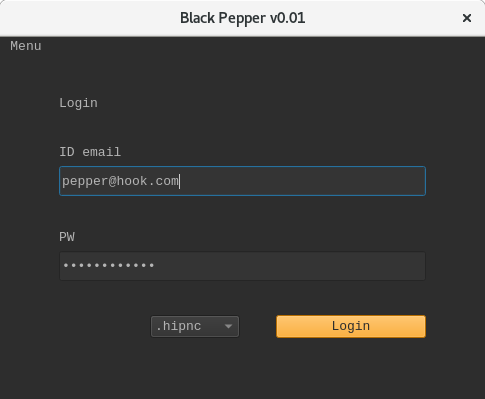

# What is Black Pepper
### Black Pepper is FX templates 에 캐스팅된 샷들을 jpg,mov render를  자동화 해주는 API 이다.

* FX artist 가 template asset fx 에 casting 된 많은 샷들을 Houdini 에서 pre-comp 와 mantra 에서 jpg 로 render 하고
* ffmfeg 을 사용하여 jps sequnce 들을 mov 로 자동화한다. 많은 샷들의 FX 룩을 보기 위한 API 이다.  

***
### kitsu & gazu ?
* kitsu는 VFX 스튜디오 제작관리 툴 이다
* Gazu 는 Kitsu 의 Python API 이다.
  * Gazu 를 사용하면  Kitsu를 쉽게 데이터 관리를 할 수 있다.

***
## Kitsu & Gazu links:

* kitsu URL : https://github.com/cgwire/kitsu

* Gazu URL : https://github.com/cgwire/gazu
***
# Getting Started
### Target User : FX artist
### OS : Linux
### requires : Python 3.9, Houdini 19.5, Gazu, ffmpeg

# Black Pepper Download links:
* SSH clone URL: ssh://git@git.jetbrains.space/pipeline/main/hook.git
* HTTPS clone URL: https://git.jetbrains.space/pipeline/main/hook.git

# How to use Black Pepper
1. API 실행한다.
2. Login 창에서 user ID 와 PW 를 입력하고 콤보박스에서 houdini 확장자를 선택한 뒤 Login 한다.
3. 로그인한 User 의 Projects 목록 에서 Project 를 선택한다.
4. Proeject 를 선택시 task type 이 'Done'인 Fx Templates 목록을 불러온다.
5. Templates 에서 원하는 fx Template 를 선택한다.
6. Template 를 선택시 Templates 에 casting 된 Sequence-Shot 목록을 불러온다.
7. Shots list 에서 Fx pre-comp 하고 싶은 다량의 샷들을 > append 버튼으로 Render files 목록에 추가한다.
8. Render files 목록을 확인하고 Render 버튼을 누른다.
9. Progress 창이 뜨면서 Render 상태를 확인할 수 있다.
10. Progress 창에서 Render 가 완료 된다.
* Render files 목록들의 Path 를 보고싶으면 Full path 를 클릭하면 Render check list 창으로 모든 Path 들을 확인 할수 있다.
* Render files 목록의 Preset 을 정장하고싶으면 Save list 를 활용하여 Render files preset 을 저장할 수 있다.
***
## Login

#### 최초 로그인시 이후 자동 로그인이 된다.
#### 다른 아이디로 로그인 하고싶으면 메인 창에서 메뉴바의 User 에서 Logout 버튼이 있다.

***
##  Black Pepper included APIs

* pepper
* auto_login
* MVC (model, view, controller)
* houpepper
* render_process_bar
* ffmpeg_process_bar
***
## UI 구성 

#### UI 는 총 4개의 window 로 구성되어있다.

* login window 



* main window


* Progress window


* Render Check List & Full Path


***
## FileTree
<pre>
.
├── blackpepper
│   ├── assets
│   │   └── fx_template
│   │       ├── temp_breaking_glass
│   │       │   └── simulation
│   │       │       └── working
│   │       │           └── v001
│   │       │               └── blackpepper_fx_template_temp_breaking_glass_simulation_001.hipnc
│   │       ├── temp_dancing_particle
│   │       │   └── simulation
│   │       │       └── working
│   │       │           └── v001
│   │       │               └── blackpepper_fx_template_temp_dancing_particle_simulation_001.hipnc
│   │       └── temp_fire
│   │           └── simulation
│   │               └── working
│   │                   └── v001
│   │                       └── blackpepper_fx_template_temp_fire_simulation_001.hipnc
│   └── shots
│       └── sq01
│           ├── 0010
│           │   ├── fx
│           │   │   ├── output
│           │   │   │   ├── jpg_sequence
│           │   │   │   │   ├── v001
│           │   │   │   │   ├── v002
│           │   │   │   │   └── v003
│           │   │   │   │       └── blackpepper_sq01_0010_v003_####.jpg
│           │   │   │   └── movie_file
│           │   │   │       ├── v001
│           │   │   │       ├── v002
│           │   │   │       │   └── blackpepper_sq01_0010_movie_file_v002.mov
│           │   │   │       └── v003
│           │   │   │           └── blackpepper_sq01_0010_movie_file_v003.mov
│           │   │   └── working
│           │   │       ├── v001
│           │   │       ├── v002
│           │   │       └── v003
│           │   │           └── blackpepper_sq01_0010_fx_003.hipnc
│           │   └── layout_camera
│           │       └── output
│           │           └── camera_cache
│           │               ├── v000
│           │               └── v001
│           │                   └── blackpepper_sq01_0010_camera_cache_v001.abc
│           ├── 0020
│           │   ├── fx
│           │   │   ├── output
│           │   │   │   ├── jpg_sequence
│           │   │   │   │   ├── v001
│           │   │   │   │   ├── v002
│           │   │   │   │   │   └── blackpepper_sq01_0020_v002_####.jpg
│           │   │   │   │   ├── v003
│           │   │   │   │   │   └── blackpepper_sq01_0020_v003_####.jpg
│           │   │   │   │   ├── v004
│           │   │   │   │   │   └── blackpepper_sq01_0020_v004_####.jpg
│           │   │   │   │   ├── v005
│           │   │   │   │   │   └── blackpepper_sq01_0020_v005_####.jpg
│           │   │   │   │   ├── v006
│           │   │   │   │   │   └── blackpepper_sq01_0020_v006_####.jpg
│           │   │   │   │   └── v007
│           │   │   │   │       └── blackpepper_sq01_0020_v007_####.jpg
│           │   │   │   └── movie_file
│           │   │   │       ├── v001
│           │   │   │       ├── v002
│           │   │   │       │   └── blackpepper_sq01_0020_movie_file_v002.mov
│           │   │   │       ├── v003
│           │   │   │       │   └── blackpepper_sq01_0020_movie_file_v003.mov
│           │   │   │       ├── v004
│           │   │   │       │   └── blackpepper_sq01_0020_movie_file_v004.mov
│           │   │   │       ├── v005
│           │   │   │       │   └── blackpepper_sq01_0020_movie_file_v005.mov
│           │   │   │       └── v006
│           │   │   │           └── blackpepper_sq01_0020_movie_file_v006.mov
│           │   │   └── working
│           │   │       ├── v001
│           │   │       └── v002
│           │   │           └── blackpepper_sq01_0020_fx_002.hipnc
│           │   └── layout_camera
│           │       └── output
│           │           └── camera_cache
│           │               └── v001
│           │                   └── blackpepper_sq01_0020_camera_cache_v001.abc

.           .   .   .   .
.           .   .   .   .
.           .   .   .   .
</pre>
## Save Data

### user.json
#### 로그인시 로그인 정보들과 render 시 recent render files list 정보들은 json path에 자동 저장되고
#### render files list 를 save list 버튼을 통해 커스텀 저장할수 있다.
```
json save path : <root>/hook/BlackPepper/.config/user.json
```
## log
#### 아래의 항목들은 log save path 에 log 기록을 남긴다.
* 로그인 시 로그인 정보
* file tree update
* working & output file Publish
```
log save path : <root>/hook/BlackPepper/.config/hook_login.log
```
***
# Contributors
* @Sunjun Park
* @Sungwoo Park
* @Jinkwang Park
* @Yeolhoon Yoon
* @Wongyu Lee
* @Jaehyuk Lee

***
# *** License Copyright ***

### Netflix Academy 1st class Team Hook

#### This API was created in the first season of the Netflix
#### Academy and was created during the team project period by the Hook team.